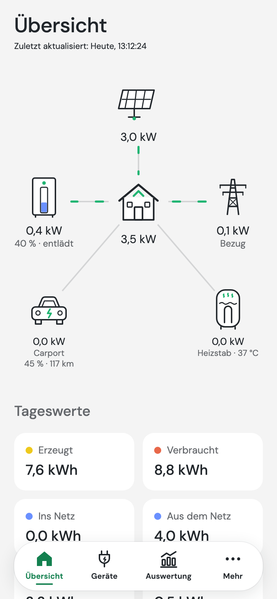
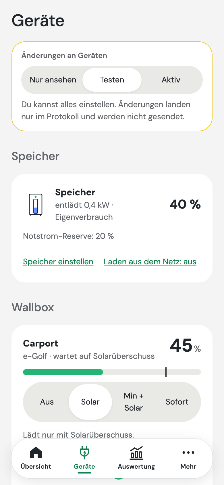
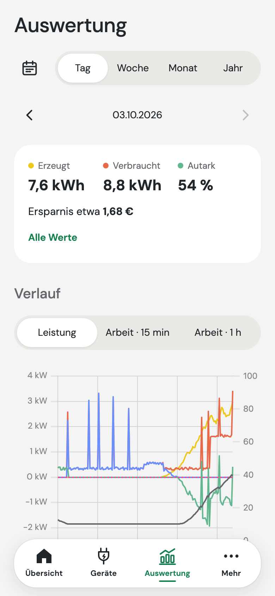
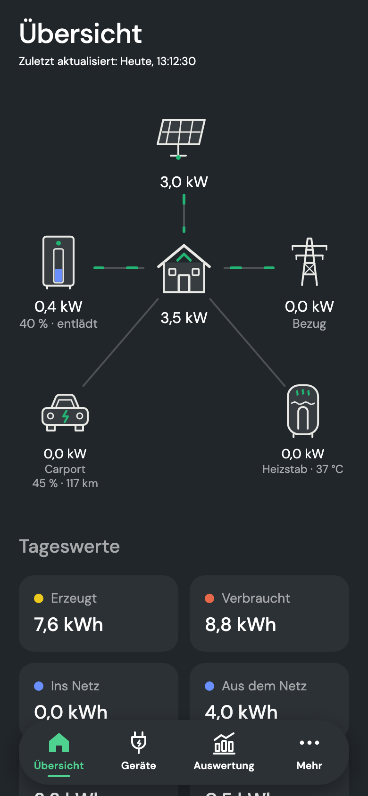

# OpenAmpere

[Website & Demo](https://gr33ndev.github.io/OpenAmpere/) · [Quellcode](https://github.com/Gr33ndev/OpenAmpere) · [Fehler melden](https://github.com/Gr33ndev/OpenAmpere/issues) · [Lizenz](LICENSE) · [Drittanbieter-Lizenzen](THIRD_PARTY_LICENSES.md) · [Sicherheit](SECURITY.md) · [Mitmachen](CONTRIBUTING.md)

**Lokale App für Solaranlagen mit Batteriespeicher, ganz ohne Cloud.**

OpenAmpere spricht direkt im Heimnetz mit dem Wechselrichter, speichert alle Daten lokal und zeigt sie im Browser an. Auf dem Smartphone lässt sich die Seite zum Home-Bildschirm hinzufügen und verhält sich dann wie eine App. Kein Konto, keine Cloud, keine Abhängigkeit von einem Hersteller-Server.

<p align="center">
  
  
  
  
</p>
<p align="center"><sub>Aus der <a href="https://gr33ndev.github.io/OpenAmpere/demo/">Demo</a> mit erfundenen Werten. Neu erzeugen mit <code>scripts/screenshots.sh</code>.</sub></p>

> Unabhängiges Community-Projekt. Hintergrund und rechtliche Hinweise stehen [am Ende dieser Seite](#hintergrund--rechtliche-hinweise).

## Unterstützte Geräte

| Gerät | Status |
|---|---|
| FoxESS H3 / H3 Smart / H3 Pro | ✅ Anzeige und Steuerung. Steuerung ist ab Werk aus. Neue oder alte Registerkarte wird automatisch erkannt. |
| SAJ H2 / HS2 | ✅ Anzeige. Die Steuerung wird erst freigegeben, wenn der Treiber an echten Geräten geprüft ist. |
| Heizstab, Wärmepumpe (SG-Ready) | ✅ Schalten bei Solarüberschuss über Shelly-Relais oder Web-Adressen. |
| Heizstab my-PV AC ELWA-E, AC ELWA 2, AC THOR | ✅ Stufenlos nach Solarüberschuss, optional mit günstigem Netzstrom. |
| Wallbox | ✅ Über [evcc](https://evcc.io): Anzeige und Bedienung in OpenAmpere, siehe [docs/evcc.md](docs/evcc.md). |

**Der Gerätetyp wird automatisch erkannt.** Die Einrichtung probiert nacheinander alle bekannten Geräte, und zwar nur lesend: FoxESS auf Geräteadresse 247, SAJ auf 1 und 2. Geräteadresse und Hersteller muss man also nicht kennen. Die Verbindung läuft über Modbus TCP, Standard ist Port 502. Neue Treiber sind willkommen, siehe `src/openampere/drivers/registry.py`.

## Funktionen

- **Menü:** Übersicht, Geräte (Speicher, Wallbox, Heizstab bedienen und die Reihenfolge für Sonnenstrom festlegen), Auswertung und Mehr (Einrichtung und Einstellungen). Ein Schalter „Nur ansehen / Testen / Aktiv“ legt fest, ob OpenAmpere etwas ändern darf.
- **Übersicht:**
  - Energiefluss live für PV, Haus, Netz und Speicher mit Ladestand, dazu Wallbox und Heizstab
  - Tageswerte
  - Autarkie
  - **Solar nach Modulfeldern:** Leistung, Spannung und Strom je PV-Eingang (MPPT), etwa für Süddach, Westdach oder Garage
  - **Temperaturen:** Wechselrichter, Speicher, Batteriezellen
- **Auswertung:**
  - Leistungskurve über den Tag mit Ladestand, Werte beim Antippen
  - Energie pro Tag (15 oder 60 Minuten), Woche, Monat und Jahr
  - Ertrag je Modulfeld
  - Temperaturverlauf
  - Verbrauch je Gerät (Wallbox, Heizstab) und Ladevorgänge
  - Autarkie, Eigenverbrauch, Verbrauch aufgeteilt nach Haushalt und Geräten, geschätzte Ersparnis
- **Stromtarife:** Festpreis oder dynamischer Tarif (Börsenpreis plus Aufschlag, Deutschland und Österreich), mehrere Tarife mit Startdatum; daraus die Ersparnis.
- **Export:** Energiewerte als CSV-Datei für Excel und Co.
- **Speicher & Notstrom:** Notstrom-Reserve, Ladegrenzen, Betriebsmodus
- **Einspeisebegrenzung:** maximale Einspeiseleistung anzeigen und ändern. Man gibt die installierte Modulleistung (kWp) und die geltende Regel an: 60 % nach dem Solarspitzengesetz (bis ein intelligentes Messsystem mit Steuerbox eingebaut ist), die frühere 70-%-Regel, ein fester Wert aus der Netzanschlusszusage (z. B. Nulleinspeisung) oder keine Begrenzung. Die Prozente beziehen sich auf die Modulleistung, nicht auf den Wechselrichter; mehr als die Regel erlaubt, lässt die App nicht zu. **Bei einem festen Wert vom Netzbetreiber ist jede Erhöhung nur mit dessen schriftlicher Zustimmung zulässig**; die App verlangt dafür eine Bestätigung und protokolliert Datum und Zeichen. „Keine Begrenzung“ setzt eine ausdrückliche Erklärung voraus, die ebenfalls protokolliert wird.
- **Verlauf aus der EKD-Cloud übernehmen:** Für bisherige Nutzer der App „Ampere.IQ“. Unter **Mehr → Daten & Sicherung** den API-Schlüssel aus der Ampere.IQ-App eintragen und den Import starten. Der Import nutzt nur die öffentliche Kunden-API mit dem eigenen Schlüssel; OpenAmpere hat nichts mit EKD zu tun, siehe [rechtliche Hinweise](#hintergrund--rechtliche-hinweise).
  - Er läuft im Hintergrund mit höchstens einer Anfrage pro Minute.
  - Nach einem Neustart macht er dort weiter, wo er aufgehört hat.
  - Alternativ lässt sich ein ZIP aus dem [Export-Werkzeug](tools/cloud-export/) einlesen.
- **Cloud-kompatible Schnittstelle:** `/api/v1/customer/installation` und `/api/v1/installation/{id}/now/all/power` antworten wie die bisherige Cloud-Kunden-API. Vorhandene Werkzeuge stellt man nur auf die neue Adresse um.
- **Laden aus dem Netz (experimentell):** zum günstigsten Börsenpreis oder in einem festen Zeitfenster, bis zu einem Ladeziel. Läuft nur über die Fernsteuerung des Wechselrichters mit Zeitbegrenzung, im Testmodus nur protokolliert; vorher sind rechtliche Hinweise zu bestätigen (EEG-Speicher, § 14a EnWG).
- **Überschuss nutzen:** Ein my-PV-Heizstab (AC ELWA-E, AC ELWA 2, AC THOR) folgt dem Solarüberschuss stufenlos, mit Mindestüberschuss, Höchstleistung, Speicher-Vorrang und optional günstigem Netzstrom. Wärmepumpe (SG-Ready) oder andere Geräte schaltet OpenAmpere über Shelly-Relais oder Web-Adressen, nach Priorität, mit Mindestlauf- und Mindestpausenzeit.
- **Benachrichtigungen** über ntfy: Wechselrichter nicht erreichbar, Störung, überschriebene Einstellung, Speicher voll, günstigster Strom morgen.
- **Diagnose (nur lesen):** prüft Registerkarte, Funktionscodes, optionale Blöcke, Skalierung, Einspeisebegrenzung, Verbindungsabbrüche und Tageszähler des eigenen Geräts und erstellt einen Bericht zum Teilen. **Vor der ersten Änderung am Wechselrichter einmal ausführen.**
- **Wallbox mit evcc:** Wallboxen steuert das eigenständige Open-Source-Projekt [evcc](https://evcc.io). OpenAmpere liefert evcc die Messwerte von Netz, Solar und Speicher, sodass evcc keine eigene Verbindung zum Wechselrichter braucht, und zeigt die Ladepunkte in der App: Lademodus, Ladeziel, Mindestladung, Ladeplan, Uhrzeit bis zum Ziel und Ladevorgänge. Ist das Auto selbst in evcc eingerichtet, kommen Ladestand und Reichweite dazu, und die Auswertung zeigt gefahrene Kilometer, Kilometer mit Sonnenstrom, Verbrauch pro 100 km und Kosten pro 100 km im Vergleich zu Netzstrom. Ob Wallbox oder Heizstab zuerst Überschuss bekommt, ist einstellbar. Einrichtung: [docs/evcc.md](docs/evcc.md). Danke an die evcc-Community!
- Siehe auch [docs/architektur.md](docs/architektur.md).

## Installation

**Voraussetzungen:** ein Linux-Rechner im selben Netz wie der Wechselrichter (Raspberry Pi mit 64-Bit-System, NAS, Proxmox …) und Modbus TCP am Wechselrichter eingeschaltet. Das Einschalten kann auch der Installationsbetrieb erledigen.

**1. Installieren:** Auf dem Rechner im Terminal ausführen:

```bash
curl -fsSL https://gr33ndev.github.io/OpenAmpere/install.sh | bash
```

Das Script installiert bei Bedarf Docker, fragt nach dem Ordner (Standard `/opt/openampere`) und ob es evcc für eine Wallbox mit einrichten soll. Zeitzone und einen freien Port erkennt es selbst. Am Ende zeigt es die Adresse der App. Zum Aktualisieren führt man es einfach erneut aus. Was es tut, steht in [scripts/install.sh](scripts/install.sh).

**2. Im Browser einrichten:** Die angezeigte Adresse öffnen, meist `http://<server-ip>:8080`, und ein **Passwort** festlegen. Ein **Einrichtungsassistent** sucht den Wechselrichter im Heimnetz, alternativ gibt man die IP-Adresse ein. Er testet die Verbindung und speichert sie. Ansehen kann man die Werte im Heimnetz ohne Passwort. Einstellungen ändern, Steuerbefehle und Datensicherung brauchen eine Anmeldung.

**3. Optional: Heizstab oder Wärmepumpe.** Dafür braucht es keine weitere Software. In der App unter **Mehr → Verbindung → Heizstab und weitere Geräte** hinzufügen.

**4. Optional: Wallbox.** Die Wallbox steuert [evcc](https://evcc.io), ein eigenes Open-Source-Projekt. Hat man im Script „Wallbox“ bejaht, läuft evcc schon als zweiter Container unter `http://<server-ip>:7070`, und OpenAmpere kennt seine Adresse. Dann:
1. In evcc Wallbox und Fahrzeug einrichten.
2. In OpenAmpere unter **Mehr → Verbindung → Wallbox** die Zähler-Konfiguration kopieren und in evcc einfügen. So bekommt evcc die Messwerte von Netz, Solar und Speicher von OpenAmpere.

Läuft evcc schon woanders, trägt man unter Mehr → Verbindung → Wallbox dessen Adresse ein. Details stehen in [docs/evcc.md](docs/evcc.md).

**Wo was ist:** Unter **Geräte** bedient man Speicher (Notstrom-Reserve, Ladegrenzen), Wallbox und Heizstab und legt fest, wer zuerst Sonnenstrom bekommt. Unter **Mehr** liegen Meine Anlage (mit Einspeisebegrenzung), Stromtarif, Verbindung, Steuerung und Protokoll, Benachrichtigungen, Zugriffsschutz, Darstellung, Daten & Sicherung und Diagnose.

Passwort vergessen? Auf dem Server im Installationsordner `docker compose exec openampere openampere reset-password` ausführen und danach in der App ein neues festlegen.

### Installation von Hand

Wer selbst bauen oder mitentwickeln will, nimmt das Repository statt des Scripts:

```bash
git clone https://github.com/Gr33ndev/OpenAmpere.git openampere && cd openampere
mkdir -p data && sudo chown 1000:1000 data
docker compose up -d --build
```

Die App läuft im Container als Benutzer 1000 und braucht Schreibrechte auf `data/`. evcc für eine Wallbox steht in der `docker-compose.yml` als auskommentierter Dienst bereit, siehe [docs/evcc.md](docs/evcc.md).

### Zugriff von unterwegs

OpenAmpere ist fürs Heimnetz gebaut. Von unterwegs erreicht man es am sichersten über ein **VPN**: das VPN der FRITZ!Box (WireGuard), einen eigenen WireGuard-Server oder Tailscale. Danach öffnet man die App wie zu Hause über die IP-Adresse des Servers.

**Niemals per Portfreigabe direkt ins Internet stellen.** Wer die App so erreicht, kann den Wechselrichter steuern, sobald das Passwort geknackt oder abgefangen ist (kein HTTPS).

Eigene Hostnamen (z. B. ein Reverse-Proxy im Heimnetz) müssen unter `server.allowed_hosts` eingetragen werden; IP-Adressen, `localhost`, `*.local`, `*.fritz.box`, `*.home.arpa` und Tailscale-Namen (`*.ts.net`) funktionieren ohne Eintrag.

Für eine automatisierte Installation lassen sich alle Werte zusätzlich per `data/config.yaml` (siehe `config.example.yaml`) oder per Umgebungsvariable `OPENAMPERE_…` vorgeben. Umgebungsvariablen haben Vorrang und erscheinen in der App als „fest eingestellt“.

### Betrieb hinter einem Modbus-Proxy

Hängt am Wechselrichter noch ein anderer Energiemanager (z. B. die bisherige Smartbox), teilt man den Modbus-Zugang oft über einen **Modbus-TCP-Proxy**. OpenAmpere kommt damit zurecht:
- In der App unter **Mehr → Verbindung** Adresse, **Port** und **Geräteadresse** des Proxys eintragen. Die Netzsuche nutzt den dort eingestellten Port.
- Meldet der Proxy kurzzeitig, dass der Wechselrichter nicht antwortet (Modbus-Fehler 10/11), oder kommt eine Antwort zu spät, wiederholt OpenAmpere die Anfrage. Erst nach mehreren Fehlschlägen in Folge gilt die Verbindung als getrennt. Dabei werden keine Register fälschlich als ungültig gemerkt.
- Bei langsamen Proxys oder WLAN das **Zeitlimit pro Anfrage** erhöhen (Mehr → Verbindung → Erweitert).
- Ein schreibgeschützter Proxy lehnt Steuerbefehle ab. OpenAmpere zeigt das als verständliche Meldung an.

**Wichtig:** Der Wechselrichter erlaubt nur wenige gleichzeitige Modbus-Verbindungen. Wenn noch ein anderer Energiemanager (z. B. eine bisherige Smartbox) oder eine andere Integration mit ihm spricht, kann es zu Verbindungsabbrüchen kommen.

## Entwicklung ohne echte Anlage

OpenAmpere enthält einen Simulator für den FoxESS H3.

```bash
python -m venv .venv && .venv/bin/pip install -e ".[dev]"
```

```bash
.venv/bin/python -m openampere.simulator --port 5020 --speed 20
```

```bash
OPENAMPERE_INVERTER_HOST=127.0.0.1 OPENAMPERE_INVERTER_PORT=5020 OPENAMPERE_SERVER_PORT=8089 .venv/bin/python -m openampere
```

```bash
.venv/bin/python -m openampere.demo_data --db data/openampere.db --days 60
```

Der letzte Befehl ist optional und erzeugt Demo-Verlaufsdaten.

Web-App mit Live-Reload, sie leitet die API an Port 8089 weiter:

```bash
cd web && npm install && npm run dev
```

Tests:

```bash
.venv/bin/pytest
```

Die Python-Abhängigkeiten sind in `requirements.lock` (Docker-Image, mit Prüfsummen) und `requirements-dev.lock` (Entwicklung, CI) fest versioniert. Erzeugt werden beide mit [uv](https://docs.astral.sh/uv/) aus `pyproject.toml`:

```bash
scripts/lock.sh
```

Von Hand muss das niemand machen: Der Workflow `dependencies.yml` erzeugt Lockfiles und Lizenzliste (`THIRD_PARTY_LICENSES.md` und die Liste in der App) bei jedem Push neu, der Abhängigkeiten ändert, auch in Dependabot-PRs, und committet sie auf denselben Branch. Einmal pro Woche hebt er alle Python-Abhängigkeiten auf die neuesten erlaubten Versionen und öffnet dafür einen Pull Request vom Branch `deps/python-updates`. Die CI auf GitHub prüft Tests, Web-Build, Docker-Build und ob die Lizenzliste aktuell ist.

Projektseite mit Demo: Die Startseite liegt in `site/`, die Demo ist die normale Web-App, gebaut mit `VITE_DEMO=1`. Sie simuliert eine Anlage im Browser (`web/src/demo/`) und schickt nichts an einen Server. Lokal bauen und ansehen:

```bash
scripts/build-site.sh
```

```bash
python3 -m http.server 8090 -d _site
```

Der Workflow `pages.yml` veröffentlicht die Seite auf GitHub Pages (einmalig unter Settings → Pages die Quelle „GitHub Actions“ wählen). Ein Versions-Tag (`v…`) veröffentlicht das Image für x86 und ARM unter `ghcr.io`.

## Sicherheit bei Steuerfunktionen

Alles, was auf den Wechselrichter schreibt, ist ab Werk **aus**. Freigegeben wird es in der App unter **Mehr → Steuerung**, mit Sicherheitsabfrage:
- Nach der Freigabe läuft die Steuerung zunächst im **Testmodus**. Änderungen werden dann nur protokolliert.
- Erst wenn man den Testmodus ausdrücklich beendet, werden Werte an den Wechselrichter gesendet.
- Jede Änderung landet mit altem und neuem Wert im Protokoll und wird nach dem Schreiben vom Gerät zurückgelesen.

Einstellungen wie Ladegrenzen, Betriebsmodus oder Einspeisebegrenzung speichert der Wechselrichter selbst. Sie bleiben aktiv, auch wenn OpenAmpere nicht läuft oder deinstalliert wird. Wer etwas zurücknehmen will, muss es in der App (oder beim Installationsbetrieb) wieder ändern.

Die Register zum Schreiben stammen aus der Dokumentation der Community und sind noch nicht an jeder Gerätevariante geprüft. Deshalb liest OpenAmpere jeden geschriebenen Wert zurück und meldet Abweichungen.

## Hintergrund & rechtliche Hinweise

**Wie OpenAmpere entstanden ist:**
- Laut [Handelsblatt](https://www.handelsblatt.com/unternehmen/energie/solarenergie-solarspezialist-energiekonzepte-deutschland-meldet-insolvenz-an/100258988.html) hat die Energiekonzepte Deutschland GmbH (EKD) Insolvenz angemeldet.
- Ihre App „Ampere.IQ“ funktioniert nur über Server von EKD. Sollten diese abgeschaltet werden, verlieren Anlagenbesitzer den Zugriff auf ihre Daten und Einstellungen.
- OpenAmpere entstand als lokale Alternative von Betroffenen für Betroffene.

**Warum es mit EKD-Anlagen funktioniert:** OpenAmpere spricht direkt mit den verbauten Wechselrichtern. Die von EKD als „Ampere.StoragePro E3“ vertriebenen Speicher basieren auf der FoxESS-H3-Serie, die älteren „Ampere.StoragePro“ auf SAJ H2/HS2. OpenAmpere funktioniert genauso mit diesen Geräten aus anderen Quellen.

**Keine Verbindung zu EKD oder den Herstellern:** OpenAmpere ist ein unabhängiges, inoffizielles Community-Projekt. Es steht in keinerlei Verbindung zur Energiekonzepte Deutschland GmbH, zu deren Insolvenzverwaltung, zu FoxESS, SAJ oder Kiwigrid. Es wurde von ihnen weder beauftragt noch autorisiert oder unterstützt.

**Marken:** „AMPERE“, „Ampere.IQ“, „Ampere.StoragePro“ sowie alle weiteren genannten Produkt- und Firmennamen sind Marken oder Bezeichnungen ihrer jeweiligen Inhaber. Alle Rechte daran liegen selbstverständlich bei diesen. Sie werden hier ausschließlich genannt, um zu beschreiben, mit welchen Geräten OpenAmpere zusammenarbeitet. Der Projektname bezieht sich auf die physikalische Einheit Ampere.

**Kein fremder Code:** OpenAmpere enthält keinen Code, keine Grafiken und keine Texte der Ampere.IQ-App. Der Cloud-Import nutzt ausschließlich die Kunden-API, die EKD für Kunden unter developer.ekd-solar.de beschrieben hat, mit dem persönlichen Schlüssel aus der App des jeweiligen Nutzers.

**Nutzung auf eigene Verantwortung:** OpenAmpere ist ein kostenloses Gemeinschaftsprojekt ohne Gewähr. Es ersetzt keinen Elektrofachbetrieb. Steuerfunktionen sind ab Werk ausgeschaltet. Wer Einstellungen am Wechselrichter ändert, insbesondere die Einspeisebegrenzung, ist selbst für die Einhaltung der Netzanschlussbedingungen verantwortlich. Ungeeignete Einstellungen können den Speicher belasten und Garantie- oder Gewährleistungsansprüche gegenüber Hersteller, Händler oder Insolvenzverwalter gefährden. Notiere die bisherigen Werte, bevor du etwas änderst. Die Hinweise in der App sind keine Rechtsberatung.

## Mitmachen

Fehler, Gerätediagnosen und Ideen sind willkommen – auch ohne Programmierkenntnisse. Erst ein Issue, dann der Pull Request; Details in [CONTRIBUTING.md](CONTRIBUTING.md).

## Lizenz

[MIT](LICENSE). Hinweise zu verwendeten Quellen und Marken stehen in [NOTICE](NOTICE), die Lizenzen aller mitgelieferten Open-Source-Komponenten in [THIRD_PARTY_LICENSES.md](THIRD_PARTY_LICENSES.md). Diese Datei wird mit `scripts/third_party_licenses.py` erzeugt. Bitte neu erzeugen, wenn sich Abhängigkeiten ändern.
